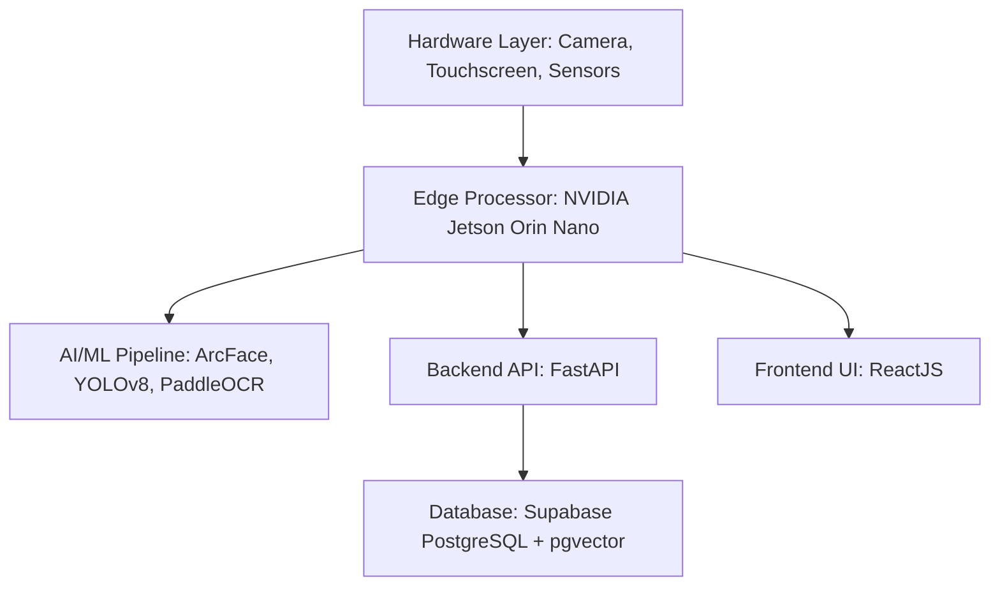

# 📋 SMARTLIB KIOSK - BÁO CÁO HỆ THỐNG CHI TIẾT

## 1. TỔNG QUAN (EXECUTIVE SUMMARY)

**SmartLib Kiosk** là giải pháp tự phục vụ (Self-service Kiosk) thông minh cho thư viện đại học, ứng dụng công nghệ AI tiên tiến để tự động hóa quy trình mượn/trả sách.

### 🌟 Tính năng cốt lõi:
- **Nhận diện khuôn mặt (FaceID)**: Xác thực sinh viên không cần thẻ vật lý.
- **Nhận diện sách (Book Detection)**: Sử dụng YOLOv8 để phát hiện sách và mã vạch thời gian thực.
- **Trích xuất thông tin (OCR)**: Sử dụng PaddleOCR để đọc tiêu đề sách từ bìa.
- **Quản lý giao dịch**: Tự động ghi chép mượn/trả và tính tiền phạt quá hạn.

---

## 2. KIẾN TRÚC HỆ THỐNG (SYSTEM ARCHITECTURE)

Hệ thống được thiết kế theo mô hình **Edge-First Architecture**, xử lý AI trực tiếp tại Kiosk (NVIDIA Jetson) để đảm bảo tốc độ phản hồi tối ưu.



---

## 3. CÁC THÀNH PHẦN KỸ THUẬT (TECHNICAL STACK)

| Thành phần | Công nghệ | Chi tiết |
|---|---|---|
| **Backend** | FastAPI | Framework Python hiệu năng cao, xử lý bất đồng bộ (async). |
| **Frontend** | ReactJS + Vite | Giao diện người dùng hiện đại, phản hồi nhanh. |
| **Database** | PostgreSQL + pgvector | Lưu trữ dữ liệu và tìm kiếm vector khuôn mặt. |
| **AI - Face** | InsightFace (ArcFace) | Model ResNet100, tạo embedding 512 chiều. |
| **AI - Object** | YOLOv8 | Phát hiện sách và barcode với tốc độ >30 FPS. |
| **AI - Text** | PaddleOCR | Trích xuất văn bản tiếng Việt từ bìa sách. |

---

## 4. QUY TRÌNH XỬ LÝ AI (AI/ML PIPELINES)

### 4.1 Quy trình Xác thực (Authentication)
1. **Detection**: Phát hiện khuôn mặt trong khung hình.
2. **Liveness Check**: Kiểm tra chống giả mạo (MiniFASNet).
3. **Embedding**: Trích xuất đặc trưng khuôn mặt (ArcFace).
4. **Matching**: So sánh vector với Database (pgvector cosine similarity).

### 4.2 Quy trình Nhận diện Sách (Book Recognition)
1. **YOLOv8**: Xác định vị trí cuốn sách và vùng chứa mã vạch.
2. **Barcode Reader**: Giải mã ISBN/BookID từ vùng mã vạch.
3. **PaddleOCR**: Đọc tiêu đề/tác giả nếu mã vạch không rõ.
4. **Validation**: Kiểm tra thông tin sách trong cơ sở dữ liệu.

---

## 5. TRẠNG THÁI TRIỂN KHAI (CURRENT STATUS)

- **Backend**: Đã hoàn thiện cấu trúc API, tích hợp ML services và database.
- **Frontend**: Các trang login, register, verify và return đã hoạt động.
- **Database**: Đã setup pgvector cho search sinh viên.
- **Fix lỗi gần nhất**:
    - Đã sửa lỗi `ReferenceError` trong `FaceCapture.jsx` liên quan đến thứ tự khởi tạo hàm.
    - Cải thiện độ ổn định của quá trình auto-capture khuôn mặt.

---

## 6. HƯỚNG DẪN VẬN HÀNH (GETTING STARTED)

### Khởi động Backend:
```powershell
cd backend
.\run.bat
```

### Khởi động Frontend:
```powershell
cd frontend
npm run dev
```

---
**Tác giả**: AI Research Team
**Phiên bản**: 1.0.0
**Ngày**: 2026-01-31
